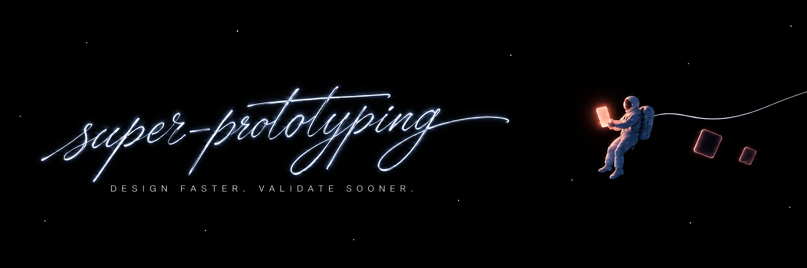

# super-prototyping

An app and a set of agent skills for rebuilding and designing product UI as
**self-contained HTML artboards on a local tldraw canvas**, with the measuring
toolkit the skills drive. Your boards stay in your project, and the app
upgrades around them.

The point of it is a replica you can defend. Every colour and every metric on a
cloned board traces back to a measurement of the source capture, and the
capture itself is parked on the canvas directly under the replica, so the two
are one glance apart rather than one memory apart.

How you use it: install the app, open the canvas, then hand Claude Code
your screenshots and ask for the `sp-clone-prototype` skill. It grids the capture,
samples it region by region, writes one measured token block, generates every
board from a single `gen.py`, then re-renders those boards and diffs them
against the capture until the numbers hold. `sp-new-ui-mock` does the same for
screens that have no reference to measure. Both write `.html` files into
`canvases/<board>/`, and the canvas picks them up as shapes with no
registry, no build step and no design tool.

## Five worked examples

Five of the app folders in `canvases/`. That folder's own
`README.md` lists them all. Each is a real `sp-clone-prototype` run, rebuilt
from measured samples with the evidence recorded for every token. Open any
of them with `?canvas=<slug>`, and one board of it with
`?canvas=<slug>#<file>`. The address follows whatever is open, the page and
the board in the inspector, so the URL in the bar is always the link to share.

### `duolingo-ios`, eight screens that are mostly picture

[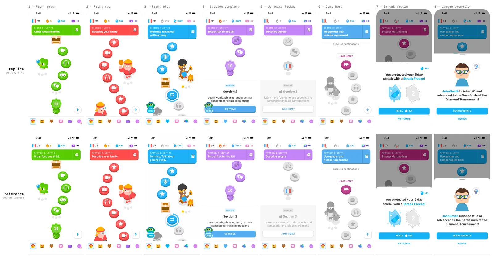](canvases/duolingo-ios/README.md)

*Replica on top, its source capture directly below it. The captures are
cropped to the same 393 × 852 screen and masked to the same 52pt corner
radius, so the two rows line up pixel for pixel. Six screens of the learning
path and the two modal sheets.*

### `luma-ios`, twelve screens and the process behind them

[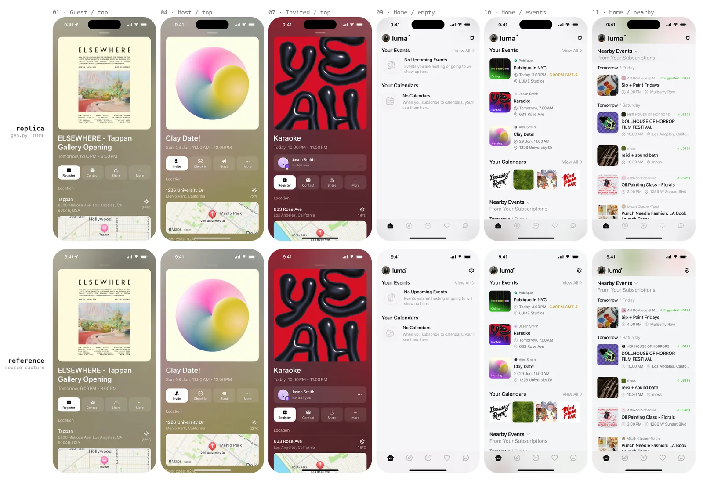](canvases/luma-ios/)

*Six of the twelve. The replica draws a Dynamic Island the capture does not
have: the source composites it out, the iOS frame spec draws it, and this run
keeps the frame and excludes the top 56pt from its numbers.*

### `notion-ios`, eighteen screens

[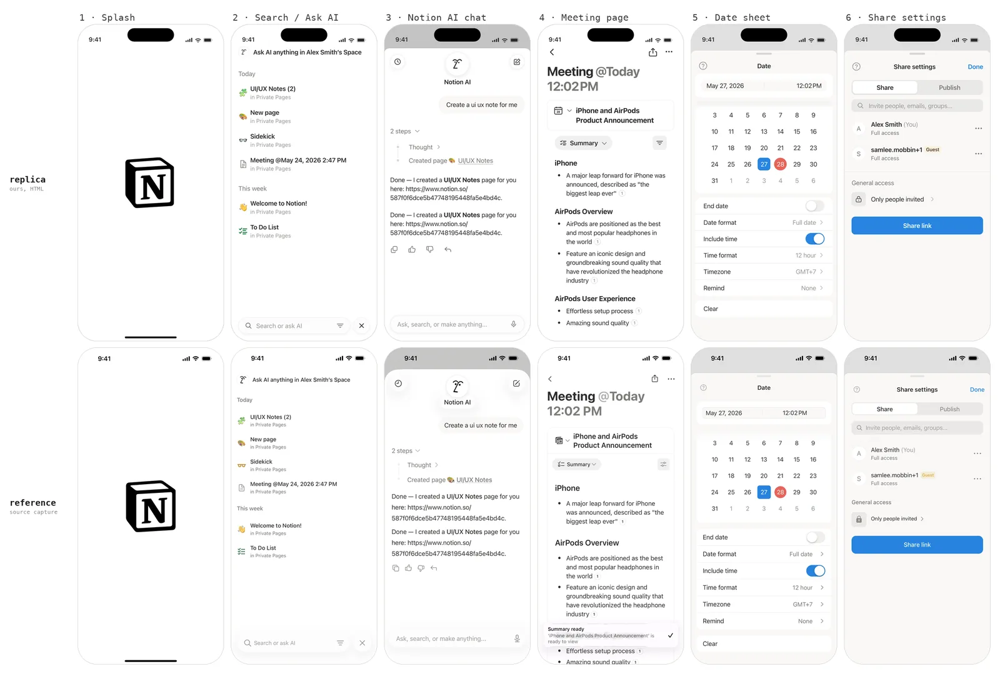](canvases/notion-ios/README.md)

*Replica on top, its source capture directly below it. @3x captures, same
crop and same scale.*

### `claude-ios`, fifteen screens across four flows

[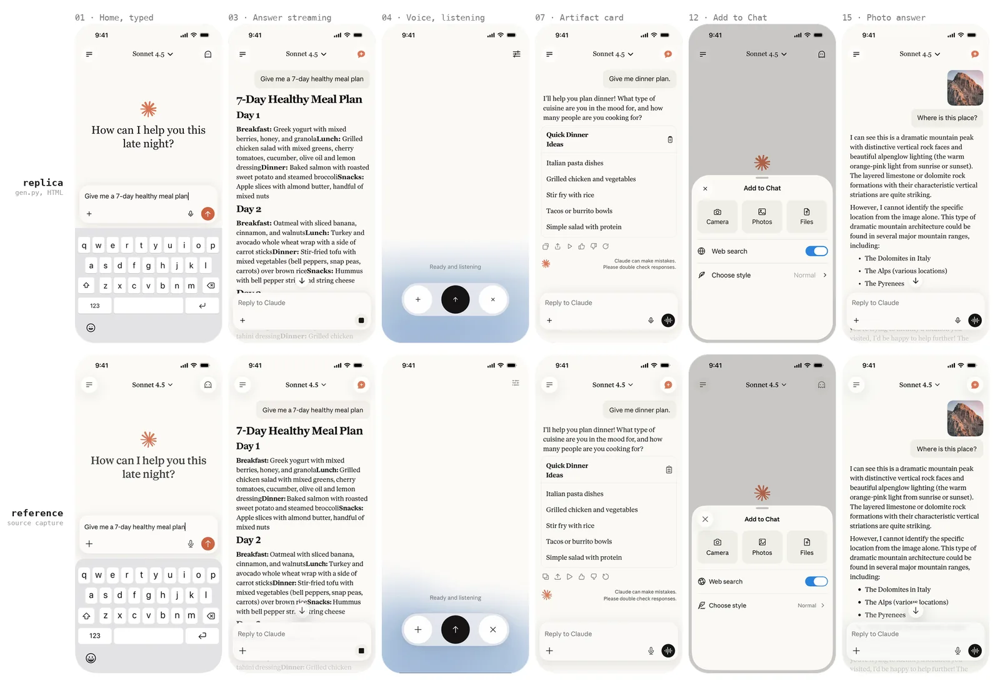](canvases/claude-ios/README.md)

*Six of the fifteen. Home, a streaming answer, voice mode, an artifact card,
the Add to Chat sheet and a photo answer. The serif answer column is set in
Georgia standing in for Tiempos, matched on cap height and about 11% wider.*

### `raycast-ios`, eleven screens across three flows

[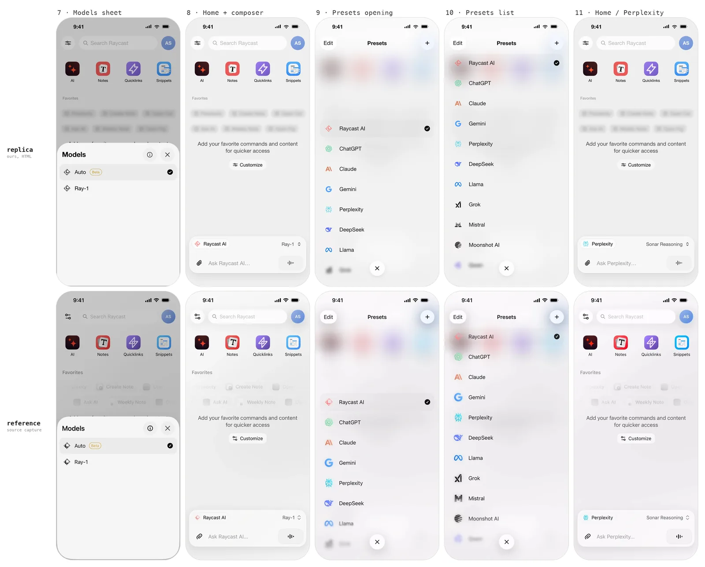](canvases/raycast-ios/README.md)

*Replica on top, source capture directly below it. Same crop, same scale, so
the two rows line up pixel for pixel. The Models sheet and Presets flows; the
six "Ask AI" screens are on the same board.*

## Install

On macOS, Homebrew installs the app:

```bash
brew install --cask ReScienceLab/tap/super-prototyping
```

Then open Super Prototyping. The cask installs the same
`Super-Prototyping-<version>-<arch>.dmg` every
[release](https://github.com/ReScienceLab/super-prototyping/releases)
attaches, so downloading that instead gives the same app, signed and notarised
from v1.5.2 on.

On Windows, releases after v1.5.2 attach `Super-Prototyping-<version>-x64.exe`.
It installs for the current user and asks for no administrator. It is not
signed, so the first time it runs Windows says "Windows protected your PC":
choose **More info**, then **Run anyway**.

From then on the app updates itself. On launch it looks for a newer release,
downloads it in the background and asks once to restart; **Later** installs it
when you quit. The first launch's welcome shows the version, and a click on it
checks again. v1.5.3 and earlier do not, so update those once by hand, with
`brew upgrade --cask super-prototyping` or the new installer.

The app is the canvas in a window, and it needs no terminal and no bun. It
opens straight onto its home page, which is no project's, and asks over it
which agent you will work with, Claude Code or Codex. New projects are made in
`Documents/Super Prototyping` from the home page or the + on the tab bar, and
each shows its `canvases` with the example canvases beside them, read-only
until you clone one into the project. The agent works in the panel on the
left, with or without a project open, and remembers the conversation until you
start a new one. It runs in a folder of its own under
`Documents/Super Prototyping/.workspaces`, which holds the skills, kept at the
app's version.

The app is also the whole install for an agent outside it. On macOS, every
launch links `sp`, `refkit` and `artgen` onto `~/.local/bin`, adds that to
your shell's PATH once, and links the skills into `~/.claude/skills`,
`~/.agents/skills` (Codex and the agents that share it), `~/.hermes/skills`
and `~/.factory/skills`, wherever that agent is installed. Every link goes
through `~/.local/share/super-prototyping/current`, which the app points at
itself on each launch, so an update moves the skills and the commands with it.
With Codex installed it also lets Codex run the three commands without asking,
as a `prefix_rule` in `~/.codex/rules/default.rules`. The commands run the
toolkit inside the app with [uv](https://docs.astral.sh/uv/). On Windows the
app links the skills the same way, as junctions, and runs `uv tool install`
on its toolkit, which puts the commands in `~\.local\bin`; uv's own installer
already put that directory on PATH. `sp uninstall` takes all of it back.

An agent that has the skills and not the app installs it itself: the
`sp-prototype-canvas` skill's `scripts/install.sh` downloads the app into
`/Applications` (or `~/Applications`) and opens it. When the app has found a
newer release, every command prints a `[super-prototyping:notice]` line on
stderr, and `sp upgrade` has the app install it.

## Start a project

Your project holds boards and nothing else — no canvas app, no toolkit, no
skills to keep in step:

```bash
mkdir -p my-product-design/canvases && cd my-product-design
cp -r "$(sp root)/canvases/templates" canvases/<slug>
python3 canvases/<slug>/gen.py
```

`sp root` prints the tree inside the app. Every worked example above
is in there to copy from too.

## Run the canvas

```bash
sp open               # the app, on its home page
sp start              # the same canvas in a browser, without the app
```

Every project is a folder under `~/Documents/Super Prototyping`, made from the
home page's New project, and served at `/p/<name>/`;
`PROTOTYPING_PROJECTS_DIR` moves that folder. No folder elsewhere is ever
opened as a project, so a project's Delete cannot trash code you did not make
there. `sp open` starts the app if it is not running and prints the address.
`sp start` is for where the app cannot run. From a checkout without a build,
it downloads the canvas built for that version into
`~/.cache/super-prototyping/`, then serves it on 127.0.0.1:5173 with node or
bun, opens the browser, and prints the address. `--port N` (or
`SP_CANVAS_PORT`) moves the port, `sp status` and `sp stop` do what
they say. `sp paths` lists the two directories it writes, and
`sp clean` removes them.

Deep-link a page with `?canvas=<slug>`, and one board of it with
`?canvas=<slug>#<file>`: it opens in the inspector with the camera on it, and
clicking any board writes that link into the address bar. Right-clicking the
canvas offers Force refresh; choose it after editing a `layout.json`. A board
folder added after boot appears on its own.

## The workflow

Six skills, in `skills/` (which `.claude/skills/` and `.agents/skills/`
symlink to, so this checkout loads what an install does):

| Skill | Use it for |
|---|---|
| **sp-clone-prototype** | Copying a real app's screens. Grid the reference, sample colours *visually*, name the type face, derive one measured token block, generate the artboards, verify by re-rendering, park the reference underneath. |
| **sp-new-ui-mock** | Designing new screens with no reference, built on existing tokens, including the empty/loading/error states and side-by-side proposals. |
| **sp-prototype-canvas** | Running and operating the canvas: boards, `layout.json`, placing boards, images and video anywhere on a canvas with `sp canvas`, annotated-screenshot review, the force-refresh. |
| **sp-define-product** | Working out what the product is before anything is drawn: an interview, one or two questions at a time, problem before solution, gaps left TBD rather than invented. It writes the project's `PRD.md`, which the canvas shows as the first tab, with the screen inventory sp-new-ui-mock designs from. |
| **sp-brand-kit** | Collecting a product's own brand and promotional material -- the company's own brand or press kit, store listings, verified social accounts, the newsroom -- and turning it into the image rows of a canvas folder, each asset carrying its source and whether the company published it. |
| **sp-scene-video** | Filming the prototype: a live-action clip of a real person using it, in an office or a lift or on the street, with the interface kept pixel-exact rather than redrawn. An animated board becomes the reference video a generative model has to keep; a green plate and a corner-pin composite are there for when it will not. |

The rule the whole thing is built around: **every colour and every metric in
a cloned artboard traces to a measurement.** Grid the reference image, look
at it, name the element, *then* write the token. Values that "look about
right" are how a replica quietly stops being one.

### sp-clone-prototype, phase by phase

Never skip ahead. Sampling before tokens, tokens before HTML.

| Phase | What actually happens | Looks like |
|---|---|---|
| **0**<br>Collect<br>references | Save every capture to a scratch dir *first*, because image caches rotate mid-task. Record the capture scale once, in px per design pt, and cross-check it against height. A 0.76 px/pt strip cannot settle thin ink, so get one native @3x capture of *any* screen in the same app.<br><br>**Out:** `p1.png … pN.png`, and one number: `300 / 393 = 0.7634`. | <a href="assets/workflow/0-capture-scale.webp">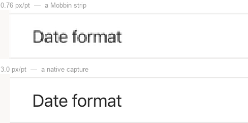</a><br><sub>One settings row, both scales. The divider survives only one of them.</sub> |
| **1a**<br>Grid,<br>then **look** | `refkit grid p4.png -o g04.png --zoom 3 --minor 10 --major 50` draws a labelled grid onto the pixels. Then you read `g04.png` **as an image** and name the element each region belongs to *before* measuring anything. Coordinates picked blind produce numbers with no element attached, and those are the ones that land in the wrong token. Gutters, row pitch, insets and radii come off the same red labels.<br><br>**Out:** a named region list, in design pt. | <a href="assets/workflow/1-grid.webp"></a><br><sub>Cyan every 10pt, red every 50. The preset rows land 64 apart. Read, not guessed.</sub> |
| **1b**<br>Sample,<br>region by<br>region | `refkit sample p4.png 76 646 132 668 --pt 3` runs a census over **one named region**; `--pt` keeps both halves in design pt, so you type the numbers you just read off the red labels. Which line of the census you believe depends on what you pointed at:<br>• page, card, sheet → **flat fills**. A pixel equal to all four neighbours is a real fill, not an antialiased edge<br>• badge, dot, brand mark → **all pixels**, top entry, on a core-only crop; too small to have a flat interior<br>• text → **ink core**, the darkest few percent. The mode of a text region is its *background*: 93% of that `Mistral` box is `#F2F2F2`<br>• pitch, edges, radii → `bands` / `bbox` / `scan`<br>• 1pt divider or border → `refkit hairline` instead; a hairline never reaches full coverage in a downscaled capture, so solve it from the ink deficit rather than picking it. A solve within ~2 of the page background means the real UI has no divider there.<br><br>**Out:** a token table with an **evidence** column. No evidence, no token. | <a href="assets/workflow/1b-sample.webp">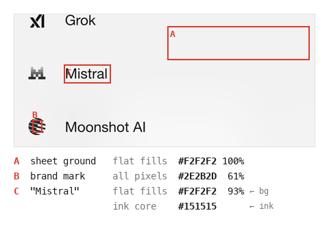</a><br><sub>Three named regions, three techniques, one crop of the Presets list. The label's own census is 93% background. The ink is the darkest 2%.</sub> |
| **1c**<br>Name the<br>face | `refkit font ref.png 17.3 139 78.7 152 Libraries --pt 3 --fonts brand/` renders that word in every candidate face and ranks the glyph shapes at a common cap height. A closed set of ~20 faces already on disk is the right problem: the published classifiers solve a 3,000-class Google-Fonts one and so structurally cannot answer *SF Pro*. Under a 0.05 top-two margin it reports **no call** rather than naming a lookalike.<br><br>**Out:** the one token nothing else could measure: `--x-font`, with evidence. [Why not a model.](docs/font-identification.md) | <a href="assets/workflow/1c-font.webp">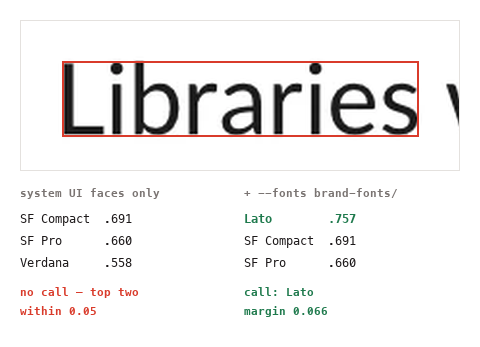</a><br><sub>One word, two candidate sets. Slack ships Lato, which is not a system face, so the left column refuses, and `--fonts` turns it into an answer.</sub> |
| **2**<br>Design<br>system | One `:root` block: the measured font stack, colour ramp, radii per component class, composite `font:` shorthands, geometry constants. Built as the *first* artboard, because it is the contract every screen is checked against.<br><br>**Out:** `00-design-tokens.html`. | <a href="assets/workflow/2-tokens.webp">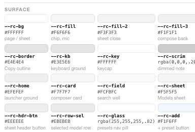</a><br><sub>Every swatch carries its hex and the element it was sampled from.</sub> |
| **3a**<br>One<br>generator | A single `gen.py` emits every screen, inlining that `:root` byte-identically. Artboards are output, never source. Hand-edit one and the next run reverts it.<br><br>**Out:** `NN-<slug>.html` × N, `layout.json`. | <a href="assets/workflow/3-generate.webp">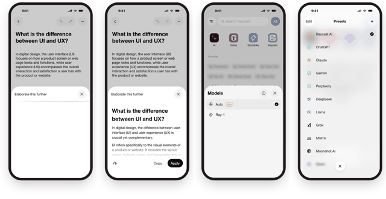</a><br><sub>Four boards out of one script. 478 × 980 each, self-contained, no shared stylesheet.</sub> |
| **3b**<br>Source the<br>artwork | Every picture already on the capture is **cropped out of the capture at its own measured box**, keyed by id in a `crops.json` the generator reads: `cut()` writes `assets/art/<id>.png`, `art()` places the `` back at the same pt numbers, so an asset cannot drift from where it was measured and a box correction is one edit rather than two. A crop is the reference's own pixels, so it scores **Δ 0** by construction, and that is the whole argument for preferring it. Generate only what no capture contains, and when you do, hand the model the answer's geometry: pack the assets into a grid, each in its own cell at the size and position it must come back at, so it upscales in place instead of composing. That is worth 18.41 &rarr; **3.96** on the same six assets. `artgen` runs it end to end and scores each asset against the crop it came from. Density is free (77 assets in one call beat 6); native size is not, so anything under ~128px stays CSS or SVG.<br><br>**Out:** `crops.json` and a committed `assets/art/`. | <a href="assets/workflow/3b-artwork.webp">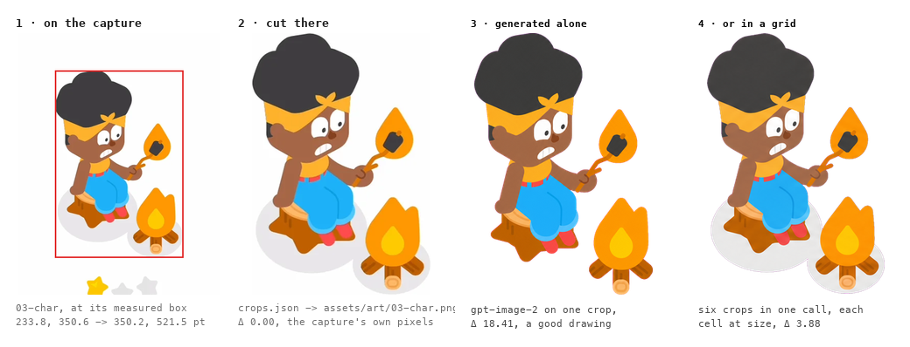</a><br><sub>One asset, four ways to get it. Generated alone it is a good drawing and a bad measurement; generated in a grid it is 4.6&times; closer and still not the crop.</sub> |
| **4**<br>Verify by<br>rendering | `shoot --crop-phone --check-overflow` renders and de-frames, `diff --regions` puts your fill next to the reference's, `tokens` audits the `:root`. Fan the *looking* out, one read-only subagent per screen, and keep a single writer for the generator.<br><br>**Out:** a Δ per region, in numbers. | <a href="assets/workflow/4-diff.webp">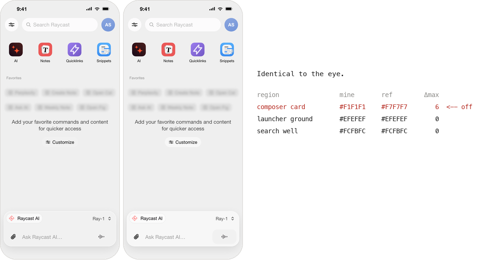</a><br><sub>Two boards, one token apart. Nothing to see; six values to fix.</sub> |
| **5**<br>Park the<br>reference | Each source capture goes into its own `ref-NN-*.html` as a `data:` URI, listed as a third `layout.json` row **in the same order** as the replicas. Rows lay out at `index × (w + gap)`, so item N lands under item N.<br><br>**Out:** every replica sits directly above its source. | <a href="assets/workflow/5-reference-row.webp">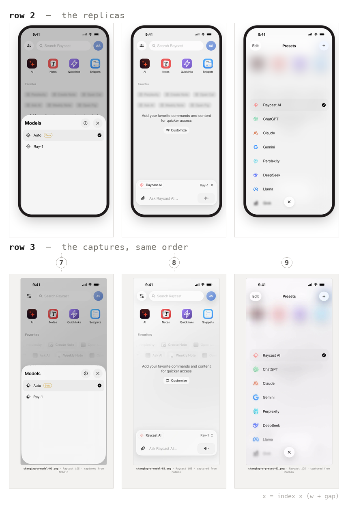</a><br><sub>Both rows as the canvas renders them. The reference artboard is the raw capture plus its attribution line. No bezel, nothing redrawn.</sub> |

The loop is 1a → 4 → 1a. A `diff` that disagrees sends you back to the grid, not
to the CSS. A correction you have not re-rendered is not a correction.

## Constraints on every artboard

Boards render in `<iframe srcDoc sandbox="">`:

- Fully self-contained: no external CSS, JS, fonts or images. `data:` URIs
  and inline SVG only.
- The shape box is **478 × 980**; overflow is silently clipped.
- iPhone frame is 393 × 852 pt at 1pt = 1px (54px status bar, 125 × 36
  Dynamic Island, 139 × 5 home indicator).

See `skills/sp-prototype-canvas/references/layout.md` for `layout.json` rows and
captions.

## Toolkit

`refkit`, `artgen` and `sp` install together as
`super-prototyping-tools`. `shoot` additionally needs Google Chrome; on
Windows, Edge will do.

```bash
refkit grid ref.png -o grid.png --zoom 3          # overlay to read by eye
refkit sample ref.png 40 120 300 160 --pt 3       # fills, modes, ink core
refkit bands ref.png 30 120 60 780 --pt 3         # ink bands and their pitch
refkit scan ref.png col 196 380 410 --pt 3        # colour runs -> exact edge
refkit hairline ref.png 40 200 300 204 --bg FFFFFF --scale 0.7634
refkit font ref.png 17 139 79 152 Libraries --pt 3 \
    --fonts ./brand-fonts                         # name the type face
refkit shoot canvases/my-app/*.html -o mine \
    --scale 3 --crop-phone --check-overflow       # render, de-frame, fail if clipped
refkit diff mine/01.png ref.png --pt 3 -o d.png   # side by side + numbers
refkit tokens canvases/my-app             # one :root, no undefined var()
refkit --version                                  # which release you are on
```

## Working on it

```bash
cd canvas && bun run lint && bun run test && bun run build
uv run --with pillow --with numpy python tools/test_refkit.py
uv run python tools/test_sp_canvas.py
(cd desktop && bun install && bun test && bun run build)   # the macOS app
scripts/bump-version.sh --check      # every file agrees on one version
```

The **Validate** workflow runs all of that on every pull request.

**Releasing.** The version is not bookkeeping: it is what the app's updater
compares against an install, so commits on main reach nobody until it moves. Dispatch the
**Release** workflow with the new version — it runs the gates, moves every
version with `scripts/bump-version.sh`, and opens a release PR, because
"Protect main" wants a pull request and nothing bypasses it. Write that
version's section in `RELEASE-NOTES.md`, then merge: the tag
`super-prototyping--v<version>` and the GitHub Release follow from the merge.
The whole procedure, including what to do when a step fails, is under "Cutting a
release" in `CONTRIBUTING.md`.

## Licence

This repo is Apache-2.0 (see `LICENSE`).

**The tldraw SDK it depends on is not.** tldraw ships under the
[tldraw licence](https://github.com/tldraw/tldraw/blob/main/LICENSE.md): free
to use with the tldraw watermark visible, paid business licence to remove it.
Apache-2.0 here covers this repo's own code only. Anyone running the canvas
is bound by tldraw's terms, and the watermark must stay.
