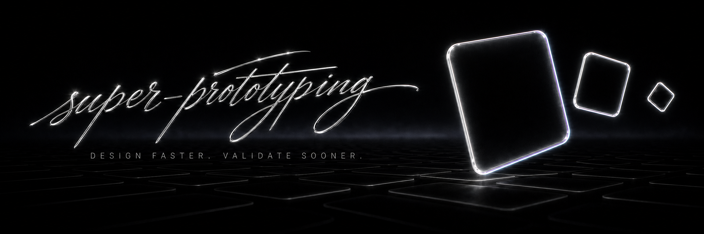
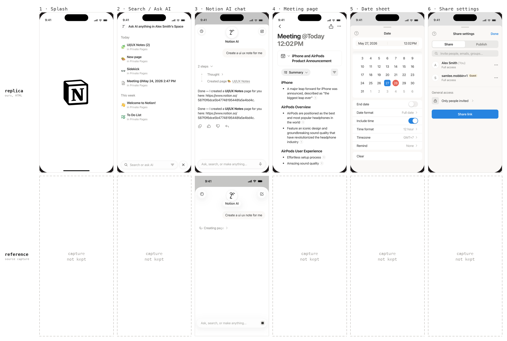
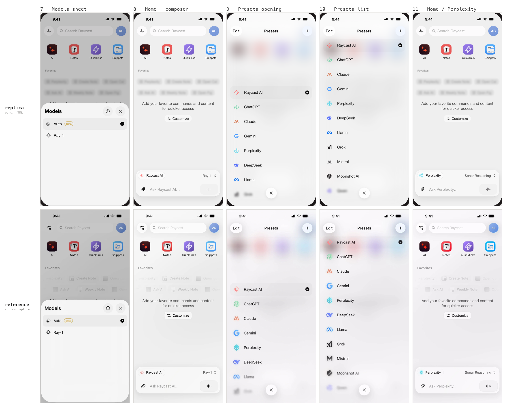
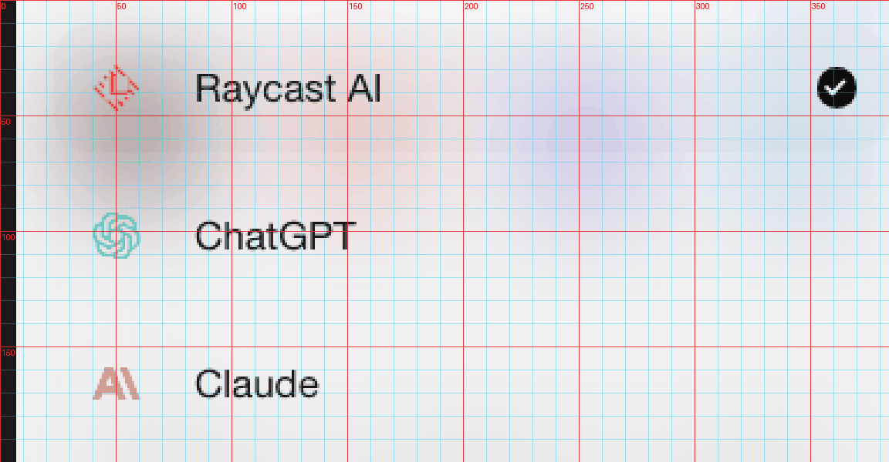
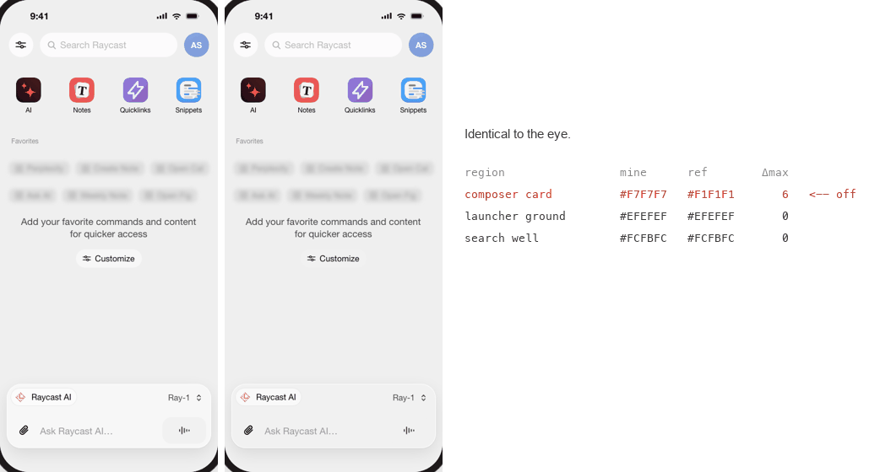
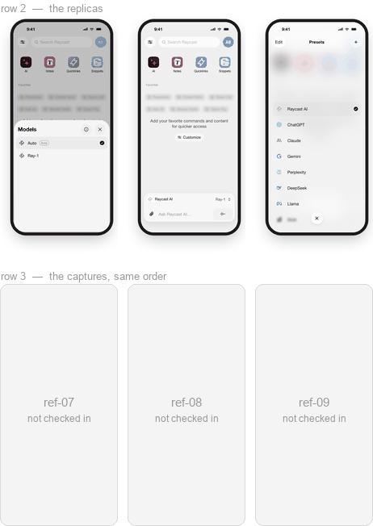
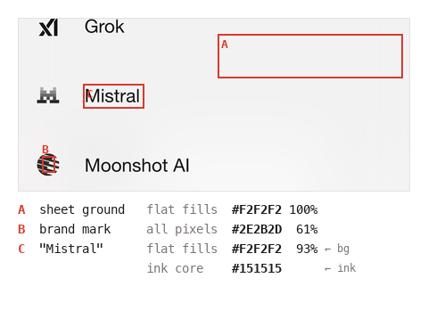

# super-prototyping

A standardized setup for cloning and designing product UI as **self-contained
HTML artboards on a local tldraw canvas**, with the agent skills that drive
the whole workflow.

Drop an `.html` file into `mockups/canvases/<board>/` and it shows up on the
canvas as a shape. That is the entire contract — no shape registry, no build
step, no design tool.

```
canvas/          the tldraw app (Vite + React + TypeScript)
mockups/
  canvases/      one folder per board → one tldraw page; one .html → one shape
  assets/        icons, logos, reference crops that get inlined as data: URIs
tools/refkit.py  measure a reference, render a board, diff the two, audit tokens
.agents/skills/  the workflow, as three skills (symlinked into .claude/skills/)
```

## Two worked examples

Both are real `clone-prototype` runs, rebuilt from measured samples with the
evidence recorded for every token. Open either with `?canvas=<slug>`.

### `notion-ios` — six screens

[](mockups/canvases/notion-ios/README.md)

*Replica on top, source capture directly below it. Only screen 3 still has its
capture on disk — the @3x Notion AI frame, curated by
[Mobbin](https://mobbin.com); the other five came off a strip that was not
kept, and the figure says so rather than quietly showing one row.*

Everything came off a single 0.7634 px/pt strip, which is why the settings
dividers had to be solved rather than picked: `--n-hairline: #E9E8E7` is a 1pt
coverage solve, and a naive sample of that same divider reports it far too
light. Two of the six references were near-matches rather than the exact
frame — a toast on one, a different date format on another — and
[the board README](mockups/canvases/notion-ios/README.md) says which, because
a near-match that goes unlabelled is how a replica quietly drifts.

### `raycast-ios` — eleven screens, three flows

[](mockups/canvases/raycast-ios/README.md)

*Replica on top, source capture directly below it — same crop, same scale, so
the two rows line up pixel for pixel. The Models sheet and Presets flows; the
six "Ask AI" screens are on the same board.* This one adds what a strip cannot settle: launcher backdrops blurred
behind a sheet, third-party brand marks (lobehub static SVGs, simple-icons for
the Raycast mark), and enough tokens that the evidence table had to move onto
its own `00b-evidence` board — 478 × 980 clips in silence.

Verified region by region against the captures:

```
region                 mine      ref        Δmax
launcher ground        #EFEFEF   #EFEFEF       0
composer card          #F7F7F7   #F7F7F7       0
search well            #FCFBFC   #FCFBFC       0
mic button             #F1F1F1   #F1F1F1       0
```

One known difference, stated rather than smoothed over: the presets backdrop
is desaturated — mean chroma 2.0 against the source's 5.9. A single CSS
Gaussian under two white veils spreads the launcher's colour blobs but
bleaches them. Luminance is not the problem; it matches to 0.1.

## Start a project from this repo

```bash
git clone --depth 1 https://github.com/ReScienceLab/super-prototyping.git my-product-design
cd my-product-design && rm -rf .git && git init
cd canvas && npm ci
```

Both boards above ship with it. Copy a `00-design-tokens.html` as the
starting point for your own token block, then delete the folders.

## Run the canvas

```bash
cd canvas
npm run dev -- --host 127.0.0.1 --port 5173 --strictPort
```

Open the URL Vite prints; deep-link a board with `?canvas=<slug>`. The bottom
toolbar carries a styles-panel toggle alongside tldraw's own tools; the top
bar carries a force-relayout button — press it after editing a `layout.json`.

## The workflow

Three skills, in `.agents/skills/` (symlinked from `.claude/skills/`, so
Claude Code picks them up automatically):

| Skill | Use it for |
|---|---|
| **clone-prototype** | Copying a real app's screens. Grid the reference, sample colours *visually*, derive one measured token block, generate the artboards, verify by re-rendering, park the reference underneath. |
| **new-ui-mock** | Designing new screens with no reference — built on existing tokens, including the empty/loading/error states and side-by-side proposals. |
| **prototype-canvas** | Running and operating the canvas: boards, `layout.json`, the `window.snapCanvas` bridge, annotated-screenshot review, the force-refresh. |

The rule the whole thing is built around: **every colour and every metric in
a cloned artboard traces to a measurement.** Grid the reference image, look
at it, name the element, *then* write the token. Values that "look about
right" are how a replica quietly stops being one.

### clone-prototype, phase by phase

Never skip ahead — sampling before tokens, tokens before HTML.

| Phase | What actually happens | Looks like |
|---|---|---|
| **0**<br>Collect<br>references | Save every capture to a scratch dir *first* — image caches rotate mid-task. Record the capture scale once, in px per design pt, and cross-check it against height. A 0.76 px/pt strip cannot settle thin ink, so get one native @3x capture of *any* screen in the same app.<br><br>**Out:** `p1.png … pN.png`, and one number — `300 / 393 = 0.7634`. | <a href="assets/workflow/0-capture-scale.png"></a><br><sub>One settings row, both scales. The divider survives only one of them.</sub> |
| **1**<br>Grid,<br>then **look** | `refkit grid` draws a labelled grid onto the pixels; you read it **as an image** and name each element before measuring anything. Then `sample` for fills and ink core, `bands`/`bbox`/`scan` for pitch and edges, `hairline` for the 1pt rules a downscaled capture dilutes.<br><br>**Out:** a token table with an **evidence** column — no evidence, no token. | <a href="assets/workflow/1-grid.png"></a><br><sub>Cyan every 10pt, red every 50. The preset rows land 64 apart — read, not guessed.</sub> |
| **2**<br>Design<br>system | One `:root` block: font stack, colour ramp, radii per component class, composite `font:` shorthands, geometry constants. Built as the *first* artboard, because it is the contract every screen is checked against.<br><br>**Out:** `00-design-tokens.html`. | <a href="assets/workflow/2-tokens.png"></a><br><sub>Every swatch carries its hex and the element it was sampled from.</sub> |
| **3**<br>One<br>generator | A single `gen_<app>.py` emits every screen, inlining that `:root` byte-identically. Artboards are output, never source — hand-edit one and the next run reverts it.<br><br>**Out:** `NN-<slug>.html` × N, `layout.json`. | <a href="assets/workflow/3-generate.png"></a><br><sub>Four boards out of one script. 478 × 980 each, self-contained, no shared stylesheet.</sub> |
| **4**<br>Verify by<br>rendering | `shoot --crop-phone --check-overflow` renders and de-frames, `diff --regions` puts your fill next to the reference's, `tokens` audits the `:root`. Fan the *looking* out — one read-only subagent per screen — and keep a single writer for the generator.<br><br>**Out:** a Δ per region, in numbers. | <a href="assets/workflow/4-diff.png"></a><br><sub>Two boards, one token apart. Nothing to see; six values to fix.</sub> |
| **5**<br>Park the<br>reference | Each source capture goes into its own `ref-NN-*.html` as a `data:` URI, listed as a third `layout.json` row **in the same order** as the replicas — rows lay out at `index × (w + gap)`, so item N lands under item N.<br><br>**Out:** every replica sits directly above its source. | <a href="assets/workflow/5-reference-row.png"></a><br><sub>Row 3 sits under row 2, item for item. Ours stays local — the captures are third-party.</sub> |

The loop is 1 → 4 → 1: a `diff` that disagrees sends you back to the grid, not to
the CSS. A correction you have not re-rendered is not a correction.

### Reading a colour off the reference

The grid does not sample anything — it is step one of two. Overlay it, read the
image, name the element each region belongs to, and *then* run the census over
that region. Coordinates picked blind produce numbers with no element attached,
and those are the numbers that end up in the wrong token.

```bash
refkit grid   p4.png -o g04.png --zoom 3 --minor 10 --major 50   # then LOOK at g04.png
refkit sample p4.png 92 645 170 668 --pt 3                       # only now, in design pt
```

[](assets/workflow/1b-sample.png)

<sub>Three regions off one crop of the Presets list. Rendered from the board in
this repo — the source captures are third-party and stay local, but the census
reads the same either way.</sub>

What you read out of `sample` depends on what you pointed it at:

| pointing at | read | why |
|---|---|---|
| page background, card, sheet | **flat fills** | a pixel equal to all four neighbours is a real fill, not an antialiased edge |
| badge, dot, chip, brand mark | **all pixels**, top entry, on a core-only crop | too small to have a flat interior |
| text | **ink core** — the darkest few percent | the mode of a text region is its *background*: 94% of that `Mistral` box is `#F2F2F2` |
| 1pt divider or border | `refkit hairline` instead | a hairline never reaches full coverage in a downscaled capture — solve it from the ink deficit, do not pick it |

`--pt` is what keeps the two halves in the same unit: you type the design pt you
read off the red labels, and the census answers in pt. A solve that lands within
~2 of the page background means the rule is invisible at this resolution, which
usually means the real UI has no divider there — not that the divider is
`#FAFAFA`.

## Constraints on every artboard

Boards render in `<iframe srcDoc sandbox="">`:

- Fully self-contained — no external CSS, JS, fonts or images. `data:` URIs
  and inline SVG only.
- The shape box is **478 × 980**; overflow is silently clipped.
- iPhone frame is 393 × 852 pt at 1pt = 1px (54px status bar, 125 × 36
  Dynamic Island, 139 × 5 home indicator).

See `mockups/canvases/README.md` for `layout.json` rows and captions.

## Toolkit

`tools/refkit.py` needs `pillow` and `numpy`; `shoot` needs Google Chrome.

```bash
python3 tools/refkit.py grid ref.png -o grid.png --zoom 3   # overlay to read by eye
python3 tools/refkit.py sample ref.png 40 120 300 160 --pt 3 # fills, modes, ink core
python3 tools/refkit.py bands ref.png 30 120 60 780 --pt 3   # ink bands and their pitch
python3 tools/refkit.py scan ref.png col 196 380 410 --pt 3  # colour runs -> exact edge
python3 tools/refkit.py hairline ref.png 40 200 300 204 --bg FFFFFF --scale 0.7634
python3 tools/refkit.py shoot mockups/canvases/my-app/*.html -o mine \
    --scale 3 --crop-phone --check-overflow                  # render, de-frame, fail if clipped
python3 tools/refkit.py diff mine/01.png ref.png --pt 3 -o d.png   # side by side + numbers
python3 tools/refkit.py tokens mockups/canvases/my-app       # one :root, no undefined var()
python3 tools/test_refkit.py                                 # self-check
```

## Verify

```bash
cd canvas && npm run lint && npm test && npm run build
```

## Licence

This repo is Apache-2.0 (see `LICENSE`).

**The tldraw SDK it depends on is not.** tldraw ships under the
[tldraw licence](https://github.com/tldraw/tldraw/blob/main/LICENSE.md): free
to use with the tldraw watermark visible, paid business licence to remove it.
Apache-2.0 here covers this repo's own code only — anyone running the canvas
is bound by tldraw's terms, and the watermark must stay.
