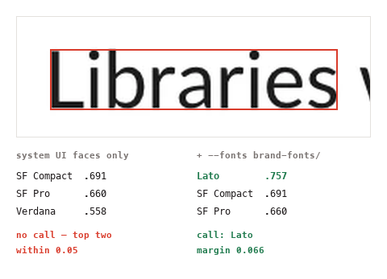

# super-prototyping

A standardized setup for cloning and designing product UI as **self-contained
HTML artboards on a local tldraw canvas**, with the agent skills that drive
the whole workflow.

Drop an `.html` file into `mockups/canvases/<board>/` and it shows up on the
canvas as a shape. That is the entire contract: no shape registry, no build
step, no design tool.

```
canvas/          the tldraw app (Vite + React + TypeScript)
mockups/
  canvases/      one folder per board → one tldraw page; one .html → one shape
  assets/        icons, logos, reference crops that get inlined as data: URIs
tools/refkit.py  measure a reference, render a board, diff the two, audit tokens
.agents/skills/  the workflow, as three skills (symlinked into .claude/skills/)
```

## Two worked examples

Both are real `clone-prototype` runs, rebuilt from measured samples with the
evidence recorded for every token. Open either with `?canvas=<slug>`.

### `notion-ios`, six screens

[](mockups/canvases/notion-ios/README.md)

*Replica on top, its source capture directly below it. @3x frames from
[Mobbin](https://mobbin.com)'s Notion iOS library, cropped to the same 393 × 852
screen and masked to the same 52pt corner radius, so the two rows line up
pixel for pixel.*

Everything came off a single 0.7634 px/pt strip, which is why the settings
dividers had to be solved rather than picked: `--n-hairline: #E9E8E7` is a 1pt
coverage solve, and a naive sample of that same divider reports it far too
light. One of the six references is a near-match rather than the exact frame,
since every capture of the meeting page carries a "Summary ready" toast.
[The board README](mockups/canvases/notion-ios/README.md) says which, because
a near-match that goes unlabelled is how a replica quietly drifts.

### `raycast-ios`, eleven screens across three flows

[](mockups/canvases/raycast-ios/README.md)

*Replica on top, source capture directly below it. Same crop, same scale, so
the two rows line up pixel for pixel. The Models sheet and Presets flows; the
six "Ask AI" screens are on the same board.* This one adds what a strip cannot settle: launcher backdrops blurred
behind a sheet, third-party brand marks (lobehub static SVGs, simple-icons for
the Raycast mark), and enough tokens that the evidence table had to move onto
its own `00b-evidence` board, because 478 × 980 clips in silence.

Verified region by region against the captures:

```
region                 mine      ref        Δmax
launcher ground        #EFEFEF   #EFEFEF       0
composer card          #F7F7F7   #F7F7F7       0
search well            #FCFBFC   #FCFBFC       0
mic button             #F1F1F1   #F1F1F1       0
```

One known difference, stated rather than smoothed over: the presets backdrop
is desaturated, mean chroma 2.0 against the source's 5.9. A single CSS
Gaussian under two white veils spreads the launcher's colour blobs but
bleaches them. Luminance is not the problem; it matches to 0.1.

## Start a project from this repo

```bash
git clone --depth 1 https://github.com/ReScienceLab/super-prototyping.git my-product-design
cd my-product-design && rm -rf .git && git init
cd canvas && npm ci
```

Both boards above ship with it. Copy a `00-design-tokens.html` as the
starting point for your own token block, then delete the folders.

## Run the canvas

```bash
cd canvas
npm run dev -- --host 127.0.0.1 --port 5173 --strictPort
```

Open the URL Vite prints; deep-link a board with `?canvas=<slug>`. The bottom
toolbar carries a styles-panel toggle alongside tldraw's own tools; the top
bar carries a force-relayout button. Press it after editing a `layout.json`.

## The workflow

Three skills, in `.agents/skills/` (symlinked from `.claude/skills/`, so
Claude Code picks them up):

| Skill | Use it for |
|---|---|
| **clone-prototype** | Copying a real app's screens. Grid the reference, sample colours *visually*, name the type face, derive one measured token block, generate the artboards, verify by re-rendering, park the reference underneath. |
| **new-ui-mock** | Designing new screens with no reference, built on existing tokens, including the empty/loading/error states and side-by-side proposals. |
| **prototype-canvas** | Running and operating the canvas: boards, `layout.json`, the `window.snapCanvas` bridge, annotated-screenshot review, the force-refresh. |

The rule the whole thing is built around: **every colour and every metric in
a cloned artboard traces to a measurement.** Grid the reference image, look
at it, name the element, *then* write the token. Values that "look about
right" are how a replica quietly stops being one.

### clone-prototype, phase by phase

Never skip ahead. Sampling before tokens, tokens before HTML.

| Phase | What actually happens | Looks like |
|---|---|---|
| **0**<br>Collect<br>references | Save every capture to a scratch dir *first*, because image caches rotate mid-task. Record the capture scale once, in px per design pt, and cross-check it against height. A 0.76 px/pt strip cannot settle thin ink, so get one native @3x capture of *any* screen in the same app.<br><br>**Out:** `p1.png … pN.png`, and one number: `300 / 393 = 0.7634`. | <a href="assets/workflow/0-capture-scale.png"></a><br><sub>One settings row, both scales. The divider survives only one of them.</sub> |
| **1a**<br>Grid,<br>then **look** | `refkit grid p4.png -o g04.png --zoom 3 --minor 10 --major 50` draws a labelled grid onto the pixels. Then you read `g04.png` **as an image** and name the element each region belongs to *before* measuring anything. Coordinates picked blind produce numbers with no element attached, and those are the ones that land in the wrong token. Gutters, row pitch, insets and radii come off the same red labels.<br><br>**Out:** a named region list, in design pt. | <a href="assets/workflow/1-grid.png"></a><br><sub>Cyan every 10pt, red every 50. The preset rows land 64 apart. Read, not guessed.</sub> |
| **1b**<br>Sample,<br>region by<br>region | `refkit sample p4.png 76 646 132 668 --pt 3` runs a census over **one named region**; `--pt` keeps both halves in design pt, so you type the numbers you just read off the red labels. Which line of the census you believe depends on what you pointed at:<br>• page, card, sheet → **flat fills**. A pixel equal to all four neighbours is a real fill, not an antialiased edge<br>• badge, dot, brand mark → **all pixels**, top entry, on a core-only crop; too small to have a flat interior<br>• text → **ink core**, the darkest few percent. The mode of a text region is its *background*: 93% of that `Mistral` box is `#F2F2F2`<br>• pitch, edges, radii → `bands` / `bbox` / `scan`<br>• 1pt divider or border → `refkit hairline` instead; a hairline never reaches full coverage in a downscaled capture, so solve it from the ink deficit rather than picking it. A solve within ~2 of the page background means the real UI has no divider there.<br><br>**Out:** a token table with an **evidence** column. No evidence, no token. | <a href="assets/workflow/1b-sample.png"></a><br><sub>Three named regions, three techniques, one crop of the Presets list. The label's own census is 93% background. The ink is the darkest 2%.</sub> |
| **1c**<br>Name the<br>face | `refkit font ref.png 17.3 139 78.7 152 Libraries --pt 3 --fonts brand/` renders that word in every candidate face and ranks the glyph shapes at a common cap height. A closed set of ~20 faces already on disk is the right problem: the published classifiers solve a 3,000-class Google-Fonts one and so structurally cannot answer *SF Pro*. Under a 0.05 top-two margin it reports **no call** rather than naming a lookalike.<br><br>**Out:** the one token nothing else could measure: `--x-font`, with evidence. [Why not a model.](docs/font-identification.md) | <a href="assets/workflow/1c-font.png"></a><br><sub>One word, two candidate sets. Slack ships Lato, which is not a system face, so the left column refuses, and `--fonts` turns it into an answer.</sub> |
| **2**<br>Design<br>system | One `:root` block: the measured font stack, colour ramp, radii per component class, composite `font:` shorthands, geometry constants. Built as the *first* artboard, because it is the contract every screen is checked against.<br><br>**Out:** `00-design-tokens.html`. | <a href="assets/workflow/2-tokens.png"></a><br><sub>Every swatch carries its hex and the element it was sampled from.</sub> |
| **3**<br>One<br>generator | A single `gen_<app>.py` emits every screen, inlining that `:root` byte-identically. Artboards are output, never source. Hand-edit one and the next run reverts it.<br><br>**Out:** `NN-<slug>.html` × N, `layout.json`. | <a href="assets/workflow/3-generate.png"></a><br><sub>Four boards out of one script. 478 × 980 each, self-contained, no shared stylesheet.</sub> |
| **4**<br>Verify by<br>rendering | `shoot --crop-phone --check-overflow` renders and de-frames, `diff --regions` puts your fill next to the reference's, `tokens` audits the `:root`. Fan the *looking* out, one read-only subagent per screen, and keep a single writer for the generator.<br><br>**Out:** a Δ per region, in numbers. | <a href="assets/workflow/4-diff.png"></a><br><sub>Two boards, one token apart. Nothing to see; six values to fix.</sub> |
| **5**<br>Park the<br>reference | Each source capture goes into its own `ref-NN-*.html` as a `data:` URI, listed as a third `layout.json` row **in the same order** as the replicas. Rows lay out at `index × (w + gap)`, so item N lands under item N.<br><br>**Out:** every replica sits directly above its source. | <a href="assets/workflow/5-reference-row.png"></a><br><sub>Both rows as the canvas renders them. The reference artboard is the raw capture plus its attribution line. No bezel, nothing redrawn.</sub> |

The loop is 1a → 4 → 1a. A `diff` that disagrees sends you back to the grid, not
to the CSS. A correction you have not re-rendered is not a correction.

## Constraints on every artboard

Boards render in `<iframe srcDoc sandbox="">`:

- Fully self-contained: no external CSS, JS, fonts or images. `data:` URIs
  and inline SVG only.
- The shape box is **478 × 980**; overflow is silently clipped.
- iPhone frame is 393 × 852 pt at 1pt = 1px (54px status bar, 125 × 36
  Dynamic Island, 139 × 5 home indicator).

See `mockups/canvases/README.md` for `layout.json` rows and captions.

## Toolkit

`tools/refkit.py` needs `pillow` and `numpy`; `shoot` needs Google Chrome.

```bash
python3 tools/refkit.py grid ref.png -o grid.png --zoom 3   # overlay to read by eye
python3 tools/refkit.py sample ref.png 40 120 300 160 --pt 3 # fills, modes, ink core
python3 tools/refkit.py bands ref.png 30 120 60 780 --pt 3   # ink bands and their pitch
python3 tools/refkit.py scan ref.png col 196 380 410 --pt 3  # colour runs -> exact edge
python3 tools/refkit.py hairline ref.png 40 200 300 204 --bg FFFFFF --scale 0.7634
python3 tools/refkit.py font ref.png 17 139 79 152 Libraries --pt 3 \
    --fonts ./brand-fonts                                   # name the type face
python3 tools/refkit.py shoot mockups/canvases/my-app/*.html -o mine \
    --scale 3 --crop-phone --check-overflow                  # render, de-frame, fail if clipped
python3 tools/refkit.py diff mine/01.png ref.png --pt 3 -o d.png   # side by side + numbers
python3 tools/refkit.py tokens mockups/canvases/my-app       # one :root, no undefined var()
python3 tools/test_refkit.py                                 # self-check
```

## Verify

```bash
cd canvas && npm run lint && npm test && npm run build
```

## Licence

This repo is Apache-2.0 (see `LICENSE`).

**The tldraw SDK it depends on is not.** tldraw ships under the
[tldraw licence](https://github.com/tldraw/tldraw/blob/main/LICENSE.md): free
to use with the tldraw watermark visible, paid business licence to remove it.
Apache-2.0 here covers this repo's own code only. Anyone running the canvas
is bound by tldraw's terms, and the watermark must stay.
